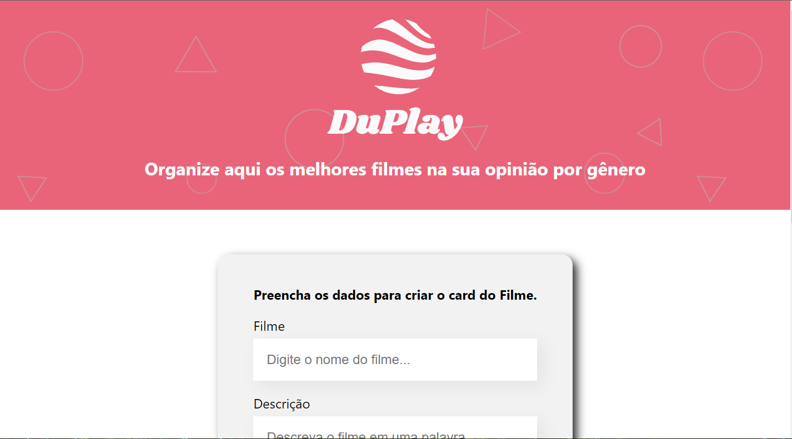

# DuPlay Movies

## Índice

- [Visao geral](#visao-Geral)
  - [Screenshot](#screenshot)
  - [Links](#links)
- [Meu processo](#meu-processo)
  - [Construido com](#Construido-com)
  - [recursos uteis](#recursos-uteis)
- [Autor](#autor)

## Visao geral

### Screenshot

### Links

- Repositorio URL: [Clique aqui para ir ao respositorio](https://github.com/EduardoBraz1/DuPlay)
- Deploy URL: [Clique aqui para ir ao site](https://duplay.netlify.app/)

## Meu processo

### Construido com

- Marcação HTML5 semântica
- Propriedades personalizadas do CSS
- Flexbox
- React
- Mobile-first

### recursos uteis

- [Flexbox guide](https://css-tricks.com/wp-content/uploads/2022/02/css-flexbox-poster.png) - Isso me ajudou para conseguir alinhar os itens da forma correta
- [React documentação](https://pt-br.reactjs.org/) - Isso me ajudou a praticar fundamentos iniciais de React

## Autor

- Github - [@EduardoBraz1](https://github.com/EduardoBraz1)
- Frontend Mentor - [@EduardoBraz1](https://www.frontendmentor.io/profile/EduardoBraz1)
- Linkedin - [Eduardo Santos Braz](https://www.linkedin.com/in/eduardo-s-8b0210161/)
